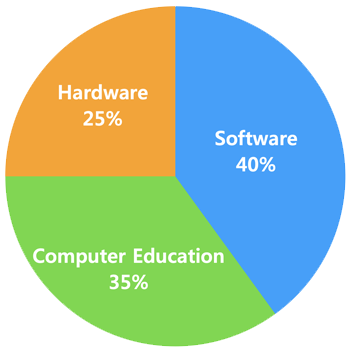

  

   
  [한국어]

  <strong>"안녕하십니까. 꾸준한 노력으로 IT분야를 선도하는 풀스택 인재, 심지훈입니다."</strong>

  어렸을 때부터 소프트웨어, 하드웨어, 컴퓨터 교육에 모두 관심을 두고 적극적으로 활동하였습니다. 소프트웨어 측면에서는, 꾸준히 IT 프로젝트를 진행해서 플레이스토어, 블로그, 카페 등에 출시한 횟수가 50을 넘었습니다. 하드웨어 측면에서는, 아두이노로 '기울기를 감지하는 게임 컨트롤러'를 구현한 적이 있습니다. 컴퓨터 교육 측면에서는, 어려운 컴퓨터 학문을 쉽게 풀어서 설명하는 블로그 활동과 강의 촬영을 하였고, 월 조회수가 1만을 넘은 적도 있습니다.

   
  [English]

  <strong>"Hello. I am JiHun Sim, a Full-Stack Talent who leads the IT field with steady efforts."</strong>

  From an early age, I have acted with interests in Software, Hardware, and Computer Education. At a side of Software, I have been steadily working on IT projects and has released over 50 on play stores, blogs and cafes. At a side of Hardware, I have implemented a 'Tilt-Sensing Game Controller' with Arduino. At a side of Computer Education, I have done Blog activity and Lecture shooting that explains difficult studies about a computer in an easy way, and the number of monthly views has exceeded 10 thousand.

   
  [日本語]

  <strong>「こんにちは。着実な努力でIT分野をリードするフルスタック人材、シム・ジフンです。」</strong>

  幼い頃からソフトウェア、ハードウェア、コンピュータ教育に皆関心を置いて積極的に活動致しました。ソフトウェアの面では、着実にITプロジェクトを進めてプレイストア、ブログ、カフェなどに発売した回数が50をお越えにしました。ハードウェアの面では、Arduinoで「チルトを検出するゲームコントローラ」を実装致したことがあります。コンピュータ教育の面では、難しいコンピュータ学問を簡単に解いて説明するブログの活動と講義の撮影をして、月の視聴回数が1万をお超えにしたこともあります。

